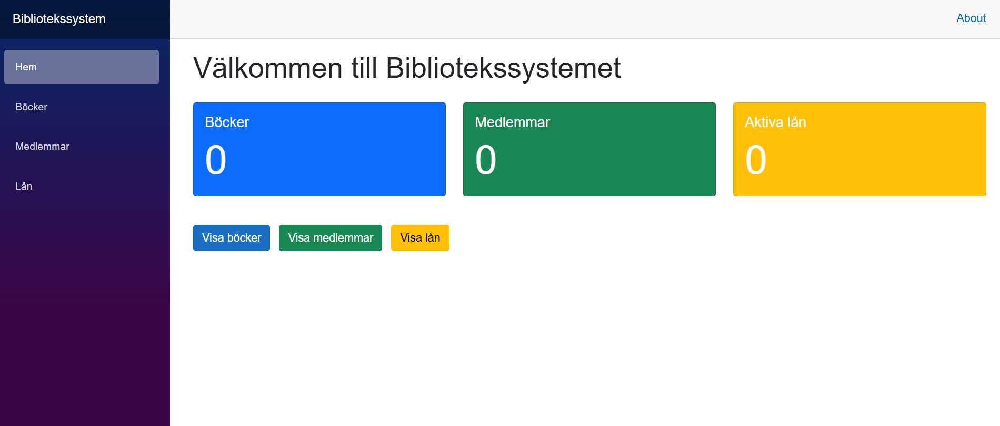
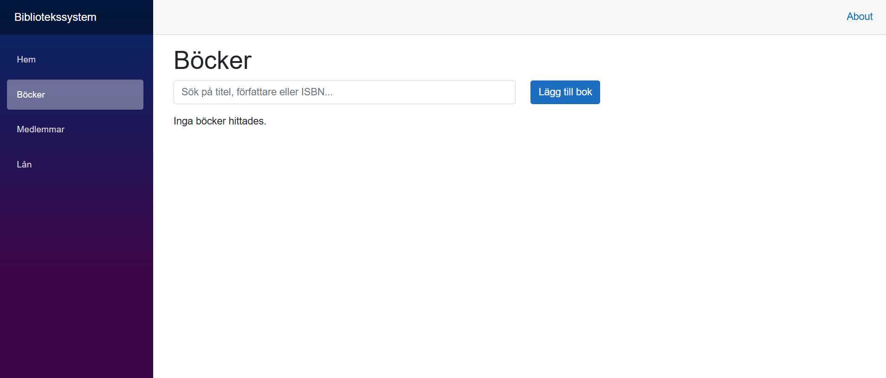
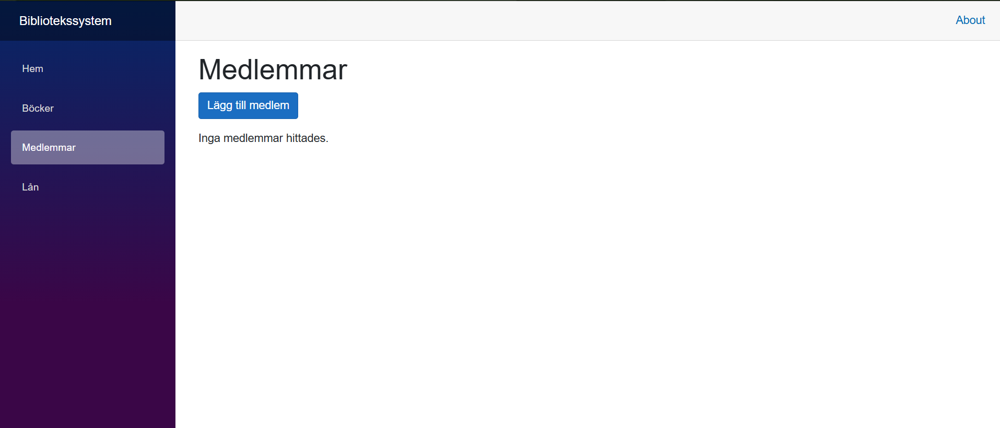
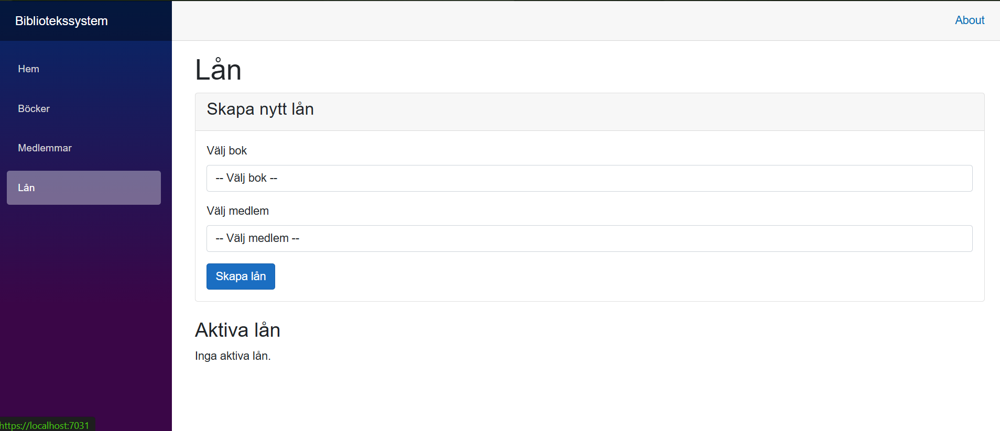
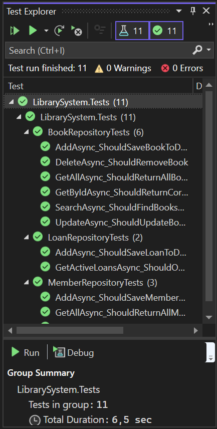

# Bibliotekssystem Del 2

Vidareutveckling av bibliotekssystemet med Entity Framework Core och Blazor Server.

## Hur man kör projektet
1. Klona projektet: `git clone https://github.com/SemirZahirovic97/BibliotekSystem.git`
2. Öppna `LibrarySystem.sln` i Visual Studio
3. Högerklicka på `LibrarySystem.Web` och välj **Set as Startup Project**
4. Öppna terminalen och kör: dotnet ef database update --project LibrarySystem.Data --startup-project LibrarySystem.Web
5. Tryck F5 för att köra

## Hur man kör testerna
1. Öppna Test Explorer: **Test → Run All Tests**
2. Alla 11 tester ska vara gröna

## Projektstruktur
- `LibrarySystem.Core` - "Mainklasser" (Book, Member, Loan)
- `LibrarySystem.Data` - Entity Framework, DbContext, Repositories
- `LibrarySystem.Web` - Blazor Server webbgränssnitt
- `LibrarySystem.Tests` - Enhetstester

## Databasmodell
Databasen använder SQLite med tre tabeller:

**Books**
- Id (int, primärnyckel)
- ISBN (string, unik)
- Title (string)
- Author (string)
- PublishedYear (int)
- IsAvailable (bool)

**Members**
- Id (int, primärnyckel)
- MemberId (string)
- Name (string)
- Email (string)
- MemberSince (DateTime)

**Loans**
- Id (int, primärnyckel)
- BookId (int, främmande nyckel → Books)
- MemberId (int, främmande nyckel → Members)
- LoanDate (DateTime)
- DueDate (DateTime)
- ReturnDate (DateTime, nullbar)

## Blazor-gränssnitt
Applikationen har följande sidor:
- **Hem** - Statistik över böcker, medlemmar och aktiva lån
- **Böcker** - Lista med sökfunktion, lägg till och visa detaljer
- **Medlemmar** - Lista med antal aktiva lån per medlem
- **Lån** - Skapa lån, visa aktiva lån och returnera böcker

## Screenshots

